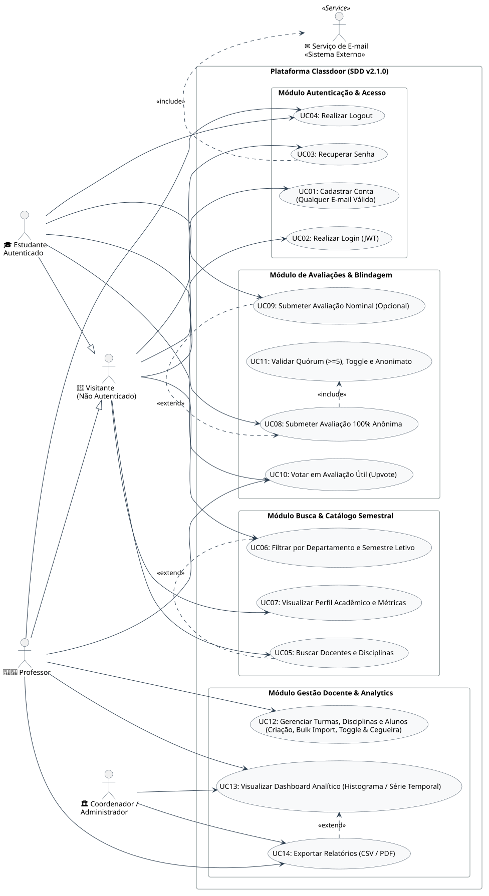
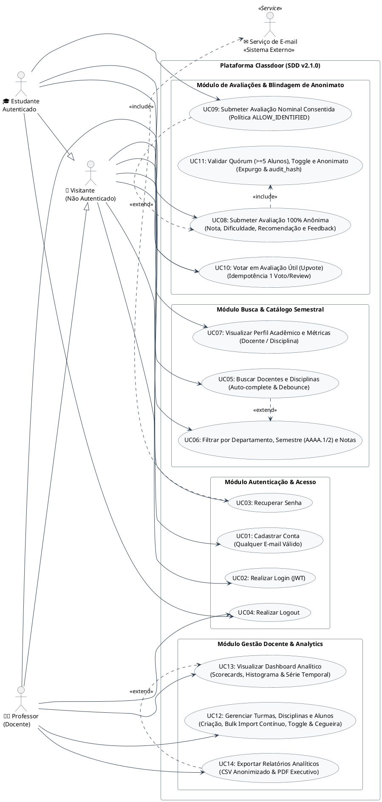

# 🎯 Diagramas e Especificação de Casos de Uso (Use Cases) — Classdoor

**Projeto:** Classdoor  
**Documento:** Diagrama de Casos de Uso UML (PlantUML) e Especificação Textual de Atores e Fluxos  
**Versão:** 2.1.0 — Gestão Flexível de Disciplinas/Turmas, Adição Contínua e Blindagem de Anonimato  
**Data:** 2026-09-08  
**Autor:** @Ada (Engenheira de Requisitos)  
**Stakeholder / CTO & PO:** @domaragao  
**Tech Lead & Arquiteto:** @Dijkstra  
**Product Manager:** @Atlas  

---

## 1. Atores do Sistema

Conforme estabelecido nas especificações de governança e arquitetura do projeto (**SDD v2.1.0** em `specs/01-Visao-Geral-e-Governanca.md` e `specs/03-Requisitos-e-User-Stories.md`), o Classdoor adota uma taxonomia estrita de **dois perfis de usuário**, além do usuário não autenticado e do serviço externo:

1. **Visitante (Usuário Não Autenticado):** Usuário externo que acessa a Home/Landing Page, realiza pesquisas globais por professores e disciplinas (com debounce e auto-complete), aplica filtros no catálogo e visualiza perfis públicos com scorecards e métricas pedagógicas.
2. **Estudante Autenticado (`ROLE_STUDENT`):** Aluno cadastrado com qualquer e-mail válido que consulta o catálogo, visualiza perfis públicos, submete avaliações (estritamente anônimas por padrão ou nominais consentidas) em turmas em que está matriculado (com quórum mínimo e toggle liberado) e interage através de votos de utilidade (*Upvotes*). *(Especialização / Herança de Visitante)*
3. **Professor / Docente (`ROLE_PROFESSOR`):** Usuário acadêmico autenticado que cria turmas associando disciplinas existentes ou cadastrando novas disciplinas no mesmo fluxo, vincula períodos letivos semestrais (`AAAA.1` / `AAAA.2`), realiza importação contínua de alunos em lote (*Bulk Import*) enquanto `reviews_count == 0`, controla o toggle de liberação de avaliações (`isEvaluationOpen`), define a política de privacidade da turma (`ANONYMOUS_ONLY` vs `ALLOW_IDENTIFIED`), opera sob o princípio de Cegueira de Acesso Docente (*Access Blindness*) e analisa o dashboard com scorecards, histograma de notas (1 a 5 estrelas), série temporal semestral e exportação de relatórios em CSV e PDF. *(Especialização / Herança de Visitante)*
4. **Serviço de Autenticação / E-mail (`<<Sistema Externo>>`):** Provedor transacional de mensageria responsável pelo disparo e entrega de tokens temporários com validade de 30 minutos para recuperação de senhas.

> 📌 **Nota de Governança Estrita (SDD):** O sistema **não** possui perfil de "Coordenador" ou "Administrador". Todas as funcionalidades acadêmicas, de gestão de turmas e analíticas são desempenhadas diretamente pelo perfil de Professor (`ROLE_PROFESSOR`).

---

## 2. Diagrama Geral de Casos de Uso (UML / PlantUML)

### 📊 Visualização Gráfica do Diagrama

---

### 💻 Código-Fonte PlantUML

---

## 3. Matriz de Casos de Uso, Requisitos e User Stories (SDD v2.1.0)

A tabela abaixo estabelece a rastreabilidade bidirecional estrita entre os Casos de Uso, os Requisitos Funcionais do Catálogo SDD e as User Stories detalhadas em `specs/03-Requisitos-e-User-Stories.md`:

| ID | Caso de Uso | Módulo / Épico | Ator(es) Primário(s) | Relacionamento(s) | Requisito Funcional (RF) | User Story | Prioridade (MoSCoW) |
|---|---|---|---|---|---|---|:---:|
| **UC01** | Cadastrar Conta | Autenticação & Acesso | Visitante | - | **RF01** (Cadastro com qualquer e-mail) | **US01** | MUST |
| **UC02** | Realizar Login (JWT) | Autenticação & Acesso | Visitante | - | **RF02** (Login com token JWT) | **US02** | MUST |
| **UC03** | Recuperar Senha | Autenticação & Acesso | Visitante | `<<include>>` Serviço de E-mail | **RF03** (Token de 30 min) | **US02** | MUST |
| **UC04** | Realizar Logout | Autenticação & Acesso | Estudante, Professor | - | **RF04** (Encerramento de sessão) | **US02** | MUST |
| **UC05** | Buscar Docentes e Disciplinas | Busca & Catálogo | Visitante | `<<extend>>` UC06 | **RF05**, **RF07** (Busca e Destaques) | **US03** | MUST / SHOULD |
| **UC06** | Filtrar Catálogo e Semestre Letivo | Busca & Catálogo | Visitante | Extensão de UC05 | **RF06** (Filtro por departamento e semestre `AAAA.1`/`2`) | **US03** | SHOULD |
| **UC07** | Visualizar Perfil Acadêmico e Métricas | Busca & Catálogo | Visitante | - | **RF08**, **RF09** (Perfis e Scorecards) | **US04** | MUST |
| **UC08** | Submeter Avaliação 100% Anônima | Avaliações & Blindagem | Estudante Autenticado | `<<include>>` UC11 | **RF18** (Submissão completa de review) | **US05** | MUST |
| **UC09** | Submeter Avaliação Nominal Consentida | Avaliações & Blindagem | Estudante Autenticado | `<<extend>>` UC08 | **RF20** (Modo nominal `ALLOW_IDENTIFIED`) | **US06** | COULD |
| **UC10** | Votar em Avaliação Útil (Upvote) | Avaliações & Blindagem | Estudante, Professor | - | **RF21** (Idempotência 1 voto/review) | **US07** | SHOULD |
| **UC11** | Validar Quórum, Toggle e Anonimato | Avaliações & Blindagem | Sistema (Automático) | Incluso em UC08 | **RF16** (Quórum $\ge 5$), **RF19** (Expurgo & audit_hash) | **US05** | MUST |
| **UC12** | Gerenciar Turmas, Disciplinas e Alunos | Gestão Docente | Professor | - | **RF10-RF15**, **RF17**, **RF22** (Criação, Bulk Add, Toggle, Cegueira, Política) | **US08** | MUST / SHOULD |
| **UC13** | Visualizar Dashboard Analítico | Gestão & Analytics | Professor | `<<extend>>` UC14 | **RF23** (Histograma e Série Temporal) | **US09** | SHOULD |
| **UC14** | Exportar Relatórios (CSV / PDF) | Gestão & Analytics | Professor | Extensão de UC13 | **RF24** (CSV anonimizado e PDF executivo) | **US09** | COULD |

---

## 4. Especificação Detalhada dos Casos de Uso

### 🔹 UC01: Cadastrar Conta (Qualquer E-mail Válido)
- **Ator Primário:** Visitante (Usuário Não Autenticado)
- **Requisito Associado:** RF01 | **User Story:** US01
- **Pré-condições:** O usuário possui conexão com a internet e não está autenticado.
- **Fluxo Principal:**
  1. O visitante acessa a tela de Cadastro (`/cadastro`).
  2. Informa Nome Completo, E-mail (qualquer provedor válido: `@gmail.com`, `@outlook.com`, institucional, etc.), Senha (mínimo 8 caracteres) e Perfil (`Estudante` ou `Professor`).
  3. O sistema valida o formato dos campos e verifica a unicidade do e-mail no banco de dados.
  4. O sistema gera a conta com a senha criptografada via BCrypt (fator de custo 12) / Argon2id e redireciona para a tela de Login com mensagem de sucesso.
- **Fluxo de Exceção (E-mail Duplicado):**
  - O sistema retorna erro amigável no padrão RFC 7807 (*"Este e-mail já está cadastrado no Classdoor"*) e oferece o link para recuperação de senha.

---

### 🔹 UC02: Realizar Login (Autenticação JWT)
- **Ator Primário:** Visitante (Usuário Cadastrado)
- **Requisito Associado:** RF02 | **User Story:** US02
- **Pré-condições:** Conta criada previamente.
- **Fluxo Principal:**
  1. O usuário informa e-mail e senha na tela de Login (`/login`).
  2. O sistema autentica as credenciais, emite token JWT assinado (HMAC-SHA256) com a role correspondente (`ROLE_STUDENT` ou `ROLE_PROFESSOR`) e inicializa a sessão ativa.
  3. O usuário é redirecionado para a Home com a interface personalizada para o seu perfil.
- **Fluxo de Exceção (Credenciais Inválidas):**
  - O sistema exibe mensagem de erro (*"E-mail ou senha incorretos"*) e mantém os campos preenchidos para nova tentativa.

---

### 🔹 UC03: Recuperar Senha
- **Ator Primário:** Visitante
- **Ator Secundário:** Serviço de E-mail (Externo)
- **Requisito Associado:** RF03 | **User Story:** US02
- **Pré-condições:** E-mail cadastrado na plataforma.
- **Fluxo Principal:**
  1. O usuário clica em *"Esqueci minha senha"*.
  2. Informa o e-mail cadastrado.
  3. O sistema gera um token temporário criptográfico com expiração estrita de 30 minutos e despacha a mensagem via `Serviço de E-mail` (`<<include>>`).
  4. O usuário clica no link recebido e cadastra uma nova senha válida.

---

### 🔹 UC04: Realizar Logout
- **Ator Primário:** Estudante Autenticado, Professor
- **Requisito Associado:** RF04 | **User Story:** US02
- **Pré-condições:** Usuário com sessão ativa no sistema.
- **Fluxo Principal:**
  1. O usuário clica na opção *"Sair"* na Navbar.
  2. O sistema invalida o token local, limpa as stores do Zustand e redireciona para `/login`.

---

### 🔹 UC05: Buscar Docentes e Disciplinas (Home & Catálogo)
- **Ator Primário:** Visitante
- **Requisito Associado:** RF05, RF07 | **User Story:** US03
- **Pré-condições:** Nenhuma.
- **Fluxo Principal:**
  1. O visitante digita um termo de busca no campo de pesquisa da Hero Section da Home.
  2. O sistema aplica debounce de 300ms e consulta em tempo real docentes e disciplinas correspondentes.
  3. O sistema renderiza os cards de resultados e os blocos de destaque ("Professores Mais Bem Avaliados" e "Disciplinas Populares").
  4. O visitante pode acionar filtros avançados via **UC06: Filtrar Catálogo e Semestre Letivo** (`<<extend>>`).

---

### 🔹 UC06: Filtrar por Departamento, Semestre Letivo e Notas
- **Ator Primário:** Visitante
- **Requisito Associado:** RF06 | **User Story:** US03
- **Pré-condições:** Catálogo acessado.
- **Fluxo Principal:**
  1. O visitante seleciona filtros por Departamento (ex: DCOMP, DEMAT), Período Letivo Semestral padronizado (dois por ano: `AAAA.1` ou `AAAA.2`, ex: `2026.1`, `2026.2`) e faixa de nota média (1 a 5 estrelas).
  2. O grid de resultados é recalculado e renderizado instantaneamente.

---

### 🔹 UC07: Visualizar Perfil Acadêmico e Métricas
- **Ator Primário:** Visitante
- **Requisito Associado:** RF08, RF09 | **User Story:** US04
- **Pré-condições:** Docente ou disciplina existente na base.
- **Fluxo Principal:**
  1. O visitante navega para `/professores/:id` ou `/disciplinas/:id`.
  2. O sistema exibe:
     - **Scorecards:** Nota Média Geral (1.0 a 5.0), Dificuldade Média (1.0 a 5.0) e Taxa de Recomendação (%).
     - **Histograma:** Distribuição gráfica de avaliações de 1 a 5 estrelas.
     - **Feed de Avaliações:** Listagem de reviews com alternância de ordenação por *"Mais Recentes"*, *"Melhor Avaliadas"* e *"Mais Úteis"*.

---

### 🔹 UC08: Submeter Avaliação 100% Anônima (Core Privacy by Design)
- **Ator Primário:** Estudante Autenticado
- **Requisito Associado:** RF18 | **User Story:** US05
- **Pré-condições:** Estudante autenticado, matriculado na turma (`class_students`), quórum mínimo de 5 discentes atingido e toggle aberto pelo professor.
- **Fluxo Principal:**
  1. O estudante clica em *"Avaliar"* na turma desejada.
  2. Preenche Nota Geral (1 a 5 estrelas), Dificuldade (1 a 5), Recomendação (Sim/Não) e comentário qualitativo (entre 20 e 1000 caracteres).
  3. Mantém selecionada a opção padrão *"100% Anônimo"*.
  4. O sistema dispara a validação obrigatória via **UC11: Validar Quórum, Toggle e Anonimato** (`<<include>>`).
  5. O sistema desassocia `user_id` e endereço IP do registro público, grava o `audit_hash` para evitar duplicidade, exibe o autor como *"Estudante Anônimo"* e atualiza as médias em tempo real.
- **Pós-condições:** A avaliação passa a compor o feed e as médias públicas do docente sem rastreabilidade de autoria.

---

### 🔹 UC09: Submeter Avaliação Nominal Consentida (Opcional)
- **Ator Primário:** Estudante Autenticado
- **Requisito Associado:** RF20 | **User Story:** US06
- **Pré-condições:** Turma configurada com política `ALLOW_IDENTIFIED` e requisitos de quórum/toggle atendidos.
- **Fluxo Principal:**
  1. O estudante inicia a submissão de avaliação (**UC08**).
  2. Desmarca a opção anônima e marca o termo obrigatório *"Concordo em exibir meu nome público"*.
  3. O sistema persiste a avaliação exibindo o nome público do discente no feed.
- **Fluxo de Exceção (Política Restrita a Anônimo):**
  - Em turmas com política `ANONYMOUS_ONLY`, a opção nominal permanece desabilitada e qualquer requisição direta é rejeitada com `403 Forbidden`.

---

### 🔹 UC10: Votar em Avaliação Útil (Upvote)
- **Ator Primário:** Estudante Autenticado, Professor
- **Requisito Associado:** RF21 | **User Story:** US07
- **Pré-condições:** Usuário autenticado e review existente.
- **Fluxo Principal:**
  1. O usuário clica no botão *"Útil 👍"* em uma avaliação.
  2. O sistema registra o voto com garantia de idempotência no PostgreSQL (`UNIQUE(review_id, user_id)`), incrementando imediatamente o contador público `upvotes_count`.

---

### 🔹 UC11: Validar Quórum (>= 5 Alunos), Toggle e Anonimato
- **Ator Primário:** Sistema (Processamento Automático)
- **Requisito Associado:** RF16, RF19 | **User Story:** US05
- **Pré-condições:** Invocação obrigatória por **UC08**.
- **Fluxo Principal:**
  1. **Validação de Quórum:** Verifica se a turma possui pelo menos 5 discentes matriculados (`students_count >= 5`).
  2. **Validação de Toggle:** Verifica se o docente liberou as avaliações (`is_evaluation_open == true`).
  3. **Cálculo de Unicidade Antifraude:** Computa `audit_hash = HMAC-SHA256(APP_PEPPER, user_id || class_id)` e garante que o discente não avaliou a mesma turma anteriormente.
  4. **Expurgo de Identificadores:** Remove qualquer vínculo de chave estrangeira com a identidade do aluno antes da gravação na tabela pública de reviews.
- **Fluxos de Exceção:**
  - *Quórum insuficiente (< 5 alunos):* O sistema bloqueia a avaliação com mensagem: *"A turma precisa de no mínimo 5 alunos matriculados para receber avaliações anônimas seguras."*
  - *Toggle fechado:* O sistema bloqueia o envio com mensagem: *"As avaliações para esta turma ainda não foram abertas pelo professor."*
  - *Avaliação duplicada:* O sistema rejeita com erro RFC 7807 indicando que a turma já foi avaliada pelo discente.

---

### 🔹 UC12: Gerenciar Turmas, Disciplinas e Alunos
- **Ator Primário:** Professor (Docente)
- **Requisito Associado:** RF10, RF11, RF12, RF13, RF14, RF15, RF17, RF22 | **User Story:** US08
- **Pré-condições:** Professor autenticado com perfil `ROLE_PROFESSOR`.
- **Fluxo Principal:**
  1. **Criação Flexível de Turmas e Disciplinas:**
     - O professor acessa o painel de criação de turmas.
     - Pode **selecionar uma disciplina existente** no catálogo OU **cadastrar uma nova disciplina** diretamente no mesmo fluxo (informando código, nome, departamento e ementa).
     - Define o código da turma (ex: "Turma 01") e o período letivo semestral padronizado (`AAAA.1` ou `AAAA.2`).
  2. **Adição Contínua de Alunos em Lote (Bulk Import):**
     - O professor cola múltiplos e-mails de alunos (separados por vírgula, ponto e vírgula ou quebra de linha).
     - Enquanto a turma **não possuir nenhuma avaliação** (`reviews_count == 0`), o professor pode realizar novos envios e adicionar alunos continuamente a qualquer momento.
  3. **Controle de Toggle de Avaliações:**
     - O professor aciona o toggle `isEvaluationOpen` (por padrão desligado). A liberação exige quórum mínimo de 5 alunos.
  4. **Cegueira de Acesso Docente (*Access Blindness*):**
     - O sistema exibe ao docente apenas a listagem de e-mails matriculados e o contador numérico de inscritos, ocultando integralmente status de ativação, último login ou quem já realizou avaliação.
  5. **Configuração da Política de Privacidade:**
     - O docente define a política da turma entre `Somente Anônimo (Padrão)` e `Permitir Identificado`.
- **Fluxo de Exceção (Trava Pós-Avaliação):**
  - Se `reviews_count >= 1`, o sistema bloqueia permanentemente qualquer tentativa de adicionar novos alunos, emitindo o alerta: *"Não é permitido adicionar novos alunos a uma turma que já recebeu avaliações, visando resguardar o sigilo e anonimato discente."*

---

### 🔹 UC13: Visualizar Dashboard Analítico
- **Ator Primário:** Professor (Docente)
- **Requisito Associado:** RF23 | **User Story:** US09
- **Pré-condições:** Professor autenticado.
- **Fluxo Principal:**
  1. O professor acessa o painel analítico (`/dashboard`).
  2. O sistema processa e renderiza:
     - **Painel Superior de Scorecards:** Nota Média Geral (1.0 a 5.0), Dificuldade Média, Taxa de Recomendação (%) e Total de Avaliações.
     - **Histograma de Distribuição de Frequência:** Barras horizontais com percentual e volume absoluto para cada estrela (1 a 5).
     - **Série Temporal Semestral:** Gráfico de evolução temporal comparando notas ao longo dos semestres letivos (ex.: `2024.2`, `2025.1`, `2025.2`, `2026.1`), com filtro por disciplina específica ou visão agregada.
  3. O professor pode estender a visualização gerando arquivos estruturados via **UC14: Exportar Relatórios Analíticos** (`<<extend>>`).

---

### 🔹 UC14: Exportar Relatórios Analíticos (CSV / PDF)
- **Ator Primário:** Professor (Docente)
- **Requisito Associado:** RF24 | **User Story:** US09
- **Pré-condições:** Dashboard analítico ativo (UC13).
- **Fluxo Principal:**
  1. O professor clica no formato de relatório desejado:
     - **Exportar CSV Anonimizado:** Gera arquivo tabular com colunas de data (ISO 8601), código/nome da disciplina, código da turma, semestre letivo, nota geral, dificuldade, recomendação, tipo e comentário qualitativo.
     - **Exportar PDF Executivo:** Gera documento institucional contendo cabeçalho departamental, scorecards executivos, histograma e série temporal integrados, além de listagem estruturada de pareceres qualitativos anonimizados.
  2. O arquivo é gerado e baixado no dispositivo do docente.
