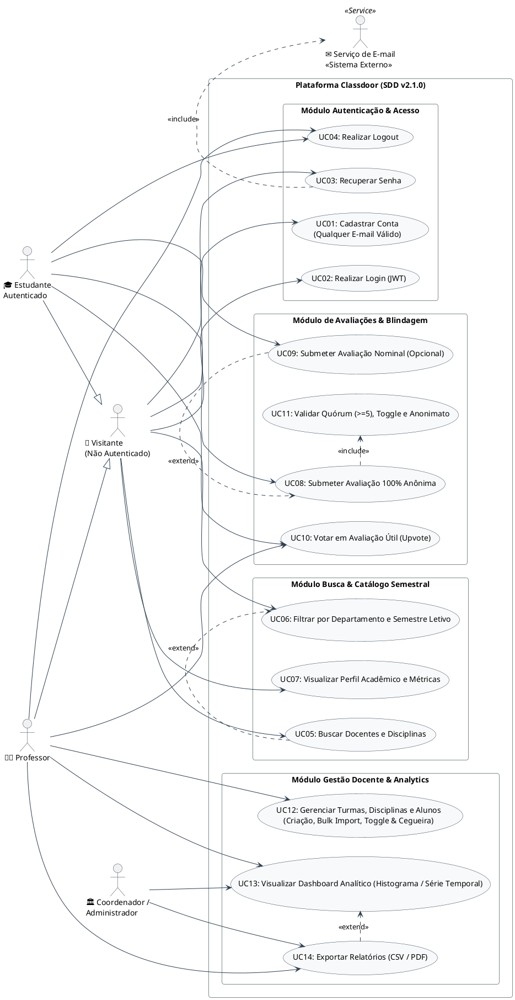

# 🎯 Diagramas e Especificação de Casos de Uso (Use Cases) — Classdoor

**Projeto:** Classdoor  
**Documento:** Diagrama de Casos de Uso UML (PlantUML) e Especificação Textual de Atores e Fluxos  
**Versão:** 2.1.0 — Gestão Flexível de Disciplinas/Turmas, Adição Contínua e Blindagem de Anonimato  
**Data:** 2026-09-08  
**Responsáveis:** @Ada (Engenheira de Requisitos) & @Atlas (Product Manager)  
**Stakeholder / CTO & PO:** @domaragao  
**Tech Lead & Arquiteto:** @Dijkstra  

---

## 1. Atores do Sistema

1. **Visitante (Usuário Não Autenticado):** Usuário externo que acessa a página inicial, pesquisa cursos/professores na busca global e visualiza perfis públicos e médias agregadas.
2. **Estudante Autenticado:** Aluno registrado com e-mail válido (sem restrição de domínio) que emite avaliações (anônimas ou nominais) para turmas em que está matriculado e interage com upvotes úteis em reviews da comunidade. *(Especialização de Visitante)*
3. **Professor / Docente:** Usuário acadêmico autenticado que cadastra/seleciona disciplinas, cria turmas semestrais (`AAAA.1`/`AAAA.2`), realiza importação em lote contínua de discentes, controla a abertura de avaliações via toggle (`isEvaluationOpen`), define políticas e analisa o dashboard de indicadores e relatórios estruturados. *(Especialização de Visitante)*
4. **Coordenador / Administrador:** Gestor acadêmico com visão consolidada para supervisão de departamentos, acompanhamento de métricas agregadas e extração de relatórios executivos.
5. **Serviço de Autenticação / E-mail (Sistema Externo):** Provedor transacional de mensageria responsável pela entrega de tokens temporários de recuperação de senha e comunicações do sistema.

---

## 2. Diagrama Geral de Casos de Uso (UML / PlantUML)

### 📊 Visualização Gráfica do Diagrama

---

### 💻 Código-Fonte PlantUML

---

## 3. Matriz de Casos de Uso e Rastreabilidade

| ID | Caso de Uso | Módulo / Épico | Ator(es) Primário(s) | Relacionamento(s) | Requisito (RF) | User Story |
|---|---|---|---|---|---|---|
| **UC01** | Cadastrar Conta (Qualquer E-mail) | Autenticação & Acesso | Visitante | - | RF01 | US01 |
| **UC02** | Realizar Login (JWT) | Autenticação & Acesso | Visitante | - | RF02 | US02 |
| **UC03** | Recuperar Senha | Autenticação & Acesso | Visitante | `<<include>>` Serviço de E-mail | RF03 | US02 |
| **UC04** | Realizar Logout | Autenticação & Acesso | Estudante, Professor | - | RF04 | US02 |
| **UC05** | Buscar Docentes e Disciplinas | Busca & Catálogo | Visitante | `<<extend>>` UC06 | RF05, RF07 | US03 |
| **UC06** | Filtrar Catálogo e Semestre Letivo | Busca & Catálogo | Visitante | Extensão de UC05 | RF06 | US03 |
| **UC07** | Visualizar Perfil Acadêmico e Métricas | Busca & Catálogo | Visitante | - | RF08, RF09 | US04 |
| **UC08** | Submeter Avaliação 100% Anônima | Avaliações & Blindagem | Estudante Autenticado | `<<include>>` UC11 | RF18, RF19 | US05 |
| **UC09** | Submeter Avaliação Nominal | Avaliações & Blindagem | Estudante Autenticado | `<<extend>>` UC08 | RF20 | US06 |
| **UC10** | Votar em Avaliação Útil (Upvote) | Avaliações & Blindagem | Estudante, Professor | - | RF21 | US07 |
| **UC11** | Validar Quórum, Toggle e Anonimato | Avaliações & Blindagem | Sistema (Automático) | Incluso em UC08 | RF16, RF19 | US05 |
| **UC12** | Gerenciar Turmas, Disciplinas e Alunos | Gestão Docente | Professor | - | RF10-RF17, RF22 | US08 |
| **UC13** | Visualizar Dashboard Analítico | Gestão & Analytics | Professor, Coordenador | `<<extend>>` UC14 | RF23 | US09 |
| **UC14** | Exportar Relatórios (CSV / PDF) | Gestão & Analytics | Professor, Coordenador | Extensão de UC13 | RF24 | US09 |

---

## 4. Especificação Detalhada dos Casos de Uso

### 🔹 UC01: Cadastrar Conta (Sem Restrição de Domínio)
- **Ator Principal:** Visitante
- **Pré-condições:** O usuário deve possuir um e-mail com formato válido (ex: `@gmail.com`, `@outlook.com` ou institucional).
- **Fluxo Principal:**
  1. O visitante acessa a tela de Cadastro.
  2. Informa Nome Completo, E-mail Válido, Senha forte (mínimo 8 caracteres) e Perfil (`Estudante` ou `Professor`).
  3. O sistema valida o formato dos campos e a unicidade do e-mail no banco de dados.
  4. O sistema cria a conta com senha criptografada via BCrypt/Argon2id e redireciona para o Login com mensagem de sucesso.
- **Fluxo de Exceção (E-mail já existente):**
  - O sistema exibe mensagem de erro amigável (*"Este e-mail já está cadastrado"*) e orienta para recuperação de senha.

---

### 🔹 UC02: Realizar Login (Autenticação JWT)
- **Ator Principal:** Visitante (Usuário Cadastrado)
- **Pré-condições:** Conta previamente criada e credenciais válidas.
- **Fluxo Principal:**
  1. O usuário informa seu e-mail e senha na tela de Login.
  2. O sistema valida o hash da senha e emite um token JWT contendo a role (`ROLE_STUDENT` ou `ROLE_PROFESSOR`).
  3. O usuário é redirecionado para a Home com a sessão inicializada.
- **Fluxo de Exceção (Credenciais Inválidas):**
  - O sistema exibe alerta de erro de autenticação e mantém o usuário na tela de login.

---

### 🔹 UC03: Recuperar Senha
- **Ator Principal:** Visitante
- **Atores Secundários:** Serviço de E-mail (Externo)
- **Pré-condições:** E-mail cadastrado na base.
- **Fluxo Principal:**
  1. O usuário clica em *"Esqueci minha senha"* e informa seu e-mail.
  2. O sistema gera um token temporário com validade de 30 minutos e aciona o `Serviço de E-mail` (`<<include>>`).
  3. O usuário acessa o link seguro recebido e define uma nova senha.

---

### 🔹 UC04: Realizar Logout
- **Ator Principal:** Estudante Autenticado, Professor
- **Pré-condições:** Usuário autenticado com sessão ativa.
- **Fluxo Principal:**
  1. O usuário clica em *"Sair"* na barra de navegação.
  2. O sistema invalida a sessão local/token e redireciona para a página de Login.

---

### 🔹 UC05: Buscar Docentes e Disciplinas
- **Ator Principal:** Visitante
- **Pré-condições:** Nenhuma.
- **Fluxo Principal:**
  1. O visitante digita o nome de um docente ou código/nome de disciplina no campo de busca da Home.
  2. O sistema processa a busca com debounce (300ms) e exibe os resultados correspondentes em tempo real.
  3. O visitante pode estender a busca aplicando filtros detalhados via **UC06: Filtrar Catálogo** (`<<extend>>`).

---

### 🔹 UC06: Filtrar por Departamento e Semestre Letivo
- **Ator Principal:** Visitante
- **Pré-condições:** Catálogo acessível.
- **Fluxo Principal:**
  1. O visitante seleciona filtros por Departamento, Semestre Letivo padronizado (dois por ano: `AAAA.1` / `AAAA.2`) e faixa de nota média (1 a 5 estrelas).
  2. A listagem é atualizada instantaneamente exibindo apenas os itens aderentes aos filtros.

---

### 🔹 UC07: Visualizar Perfil Acadêmico e Métricas
- **Ator Principal:** Visitante
- **Pré-condições:** Docente ou disciplina existente no sistema.
- **Fluxo Principal:**
  1. O visitante acessa a página do docente (`/professores/:id`) ou da disciplina (`/disciplinas/:id`).
  2. O sistema renderiza os scorecards de métricas (Nota Geral, Dificuldade, Taxa de Recomendação %), histograma de distribuição de notas (1 a 5 estrelas) e feed de avaliações com ordenação por mais recentes, melhor avaliadas ou mais úteis.

---

### 🔹 UC08: Submeter Avaliação 100% Anônima (Core do Sistema)
- **Ator Principal:** Estudante Autenticado
- **Pré-condições:** Estudante autenticado matriculado na turma com quórum e liberação validados.
- **Fluxo Principal:**
  1. O estudante seleciona a turma desejada e clica em *"Avaliar"*.
  2. Preenche Nota Geral (1 a 5 estrelas), Nível de Dificuldade (1 a 5), Recomendação (Sim/Não) e comentário detalhado (mínimo 20 e máximo 1000 caracteres).
  3. Mantém a opção padrão *"100% Anônimo"*.
  4. O sistema invoca **UC11: Validar Quórum, Toggle e Anonimato** (`<<include>>`).
  5. O sistema desassocia `user_id` e endereço IP do registro público da avaliação, gera o hash criptográfico de auditoria (`audit_hash`) para prevenção de duplicidade e persiste o review com autor *"Estudante Anônimo"*.
  6. As médias consolidadas do docente e disciplina são recalculadas em tempo real.
- **Pós-condições:** A avaliação é publicada no feed sem possibilidade de identificação ou rastreio do discente.

---

### 🔹 UC09: Submeter Avaliação Nominal (Opcional)
- **Ator Principal:** Estudante Autenticado
- **Pré-condições:** Turma configurada com política `ALLOW_IDENTIFIED` pelo docente e quórum/toggle atendidos.
- **Fluxo Principal:**
  1. O estudante inicia o fluxo de avaliação (**UC08**).
  2. Desmarca a opção de anonimato e marca expressamente o consentimento *"Concordo em exibir meu nome público"*.
  3. O sistema valida a permissão da turma e persiste o review exibindo o nome público do discente.
- **Fluxo Alternativo (Turma Restrita a Anônimo):**
  - Se a turma for `ANONYMOUS_ONLY`, a opção nominal permanece bloqueada e desabilitada.

---

### 🔹 UC10: Votar em Avaliação Útil (Upvote)
- **Ator Principal:** Estudante Autenticado, Professor
- **Pré-condições:** Usuário autenticado e avaliação publicada.
- **Fluxo Principal:**
  1. O usuário clica no botão *"Útil 👍"* em uma avaliação do feed.
  2. O sistema registra o voto com garantia de idempotência (1 voto por usuário em cada review) e incrementa o contador público.

---

### 🔹 UC11: Validar Quórum, Toggle e Anonimato
- **Ator Principal:** Sistema (Automático)
- **Pré-condições:** Submissão de avaliação disparada em **UC08**.
- **Fluxo Principal:**
  1. O sistema verifica se a turma possui quórum de pelo menos 5 alunos matriculados (`studentsCount >= 5`).
  2. O sistema verifica se o toggle de avaliações da turma está aberto (`isEvaluationOpen == true`).
  3. O sistema expurga identificadores diretos do payload público e computa `audit_hash` para garantir unicidade sem expor a identidade do autor.
- **Fluxos de Exceção:**
  - *Quórum insuficiente (< 5 alunos):* Bloqueia o envio com mensagem: *"A turma precisa de no mínimo 5 alunos matriculados para receber avaliações anônimas seguras."*
  - *Toggle desligado:* Bloqueia o envio com mensagem: *"As avaliações para esta turma ainda não foram abertas pelo professor."*

---

### 🔹 UC12: Gerenciar Turmas, Disciplinas e Alunos
- **Ator Principal:** Professor
- **Pré-condições:** Professor autenticado.
- **Fluxo Principal:**
  1. **Criação Flexível de Turmas & Disciplinas:**
     - O professor acessa a criação de turma.
     - Pode **selecionar uma disciplina existente** OU **cadastrar uma nova disciplina** no mesmo formulário (código, nome, departamento e ementa).
     - Informa o código da turma (ex: "Turma 01") e o período letivo semestral padronizado (`AAAA.1` ou `AAAA.2`).
  2. **Adição Contínua de Alunos em Lote (Bulk Import):**
     - O professor insere múltiplos e-mails de alunos (separados por vírgula, ponto e vírgula ou quebra de linha).
     - Enquanto a turma **não possuir nenhuma avaliação** (`reviews_count == 0`), o professor pode continuar adicionando novos alunos a qualquer momento.
  3. **Controle de Toggle de Avaliações:**
     - O professor controla a abertura através do toggle `isEvaluationOpen` (por padrão `false`). A abertura exige quórum mínimo de 5 alunos.
  4. **Cegueira de Acesso Docente (*Access Blindness*):**
     - O sistema exibe ao docente apenas a listagem de e-mails matriculados e contadores agregados, omitindo expressamente status de ativação, logins recentes ou indicadores individuais de quem já avaliou.
  5. **Configuração de Política de Privacidade:**
     - O professor define a política da turma entre `Somente Anônimo (Padrão)` e `Permitir Identificado`.
- **Fluxo de Exceção (Bloqueio Pós-Avaliação):**
  - Se `reviews_count >= 1`, qualquer tentativa de adicionar novos alunos é estritamente bloqueada pelo sistema para impedir ataques de desanonimização por eliminação.

---

### 🔹 UC13: Visualizar Dashboard Analítico
- **Ator Principal:** Professor, Coordenador / Administrador
- **Pré-condições:** Usuário autenticado com perfil docente ou de coordenação.
- **Fluxo Principal:**
  1. O usuário acessa a área de Dashboard (`/dashboard`).
  2. O sistema renderiza:
     - **Painel de Scorecards:** Nota Média Geral, Índice de Dificuldade, Taxa de Recomendação e Total de Avaliações.
     - **Histograma de Frequência:** Gráfico de barras horizontais com volume e % de notas (1 a 5 estrelas).
     - **Gráfico de Evolução Semestral:** Série histórica temporal comparando notas ao longo dos períodos letivos (`2024.2`, `2025.1`, `2025.2`, `2026.1`).
  3. O usuário pode acionar a exportação via **UC14: Exportar Relatórios** (`<<extend>>`).

---

### 🔹 UC14: Exportar Relatórios (CSV / PDF)
- **Ator Principal:** Professor, Coordenador / Administrador
- **Pré-condições:** Dashboard analítico ativo (UC13).
- **Fluxo Principal:**
  1. O usuário seleciona o formato desejado:
     - **CSV Tabular Anonimizado:** Contendo data, código/nome da disciplina, código da turma, semestre letivo, nota geral, dificuldade, recomendação, tipo e comentário qualitativo.
     - **PDF Executivo Institucional:** Relatório formatado com cabeçalho departamental, scorecards, histograma e série temporal integrados, além do parecer qualitativo consolidado.
  2. O sistema gera e inicia o download do arquivo estruturado.
