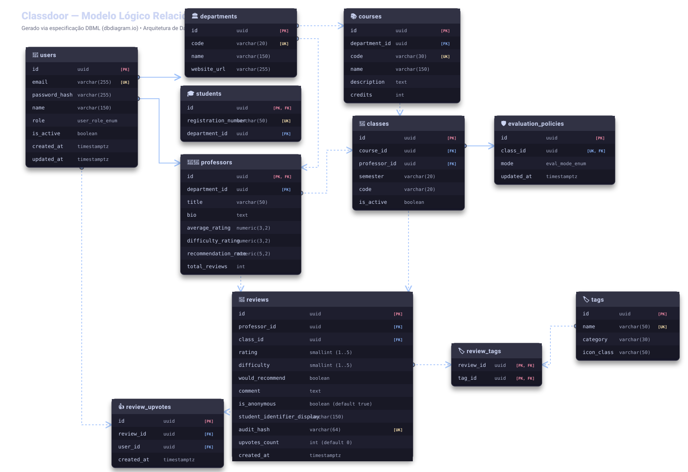

# 🗄️ Modelo Lógico do Banco de Dados — Classdoor

**Projeto:** Classdoor  
**Documento:** Modelo Entidade-Relacionamento (MER Lógico), Especificação DBML (dbdiagram.io), Dicionário de Dados e Estratégia de Persistência  
**SGBD Alvo:** PostgreSQL 16+  
**Data:** 2026-09-05  
**Responsáveis:** @Codd (DBA & Arquiteto de Dados Relacionais) & @Atlas (Product Manager)  

---

## 1. Visualização Gráfica do Modelo Lógico (DBML / SVG)

O diagrama abaixo representa o modelo relacional completo da plataforma Classdoor em conformidade com a 3ª Forma Normal (3FN), destacando chaves primárias (PK), chaves estrangeiras (FK), restrições de unicidade (UK), tipos de dados nativos do PostgreSQL e cardinalidades relacionais (1:1, 1:N, N:M).



---

## 2. Especificação DBML Oficial (dbdiagram.io)

O código abaixo em **DBML (Database Markup Language)** é a fonte de verdade para renderização, exportação DDL e sincronização de schemas via dbdiagram.io:

```dbml
// =======================================================
// CLASSDOOR - MODELO LÓGICO DE BANCO DE DADOS (DBML)
// SGBD: PostgreSQL 16+
// DBA: @Codd (Equipe XIUD)
// =======================================================

// --- TIPOS ENUMERADOS (ENUMS) ---

Enum user_role {
  STUDENT [note: 'Estudante da graduação/pós-graduação']
  PROFESSOR [note: 'Docente ou orientador acadêmico']
}

Enum evaluation_mode {
  ANONYMOUS_ONLY [note: 'Apenas avaliações estritamente anônimas permitidas']
  ALLOW_IDENTIFIED [note: 'Permite avaliações com identificação nominal opcional']
}

// --- TABELAS CENTRAIS & IDENTIDADE ---

Table users {
  id uuid [pk, default: `gen_random_uuid()`, note: 'Identificador único global do usuário (UUIDv7/v4)']
  email varchar(255) [not null, unique, note: 'E-mail institucional (@edu / @universidade.br)']
  password_hash varchar(255) [not null, note: 'Hash criptográfico da senha (BCrypt / Argon2id)']
  name varchar(150) [not null, note: 'Nome completo do usuário']
  role user_role [not null, default: 'STUDENT', note: 'Papel de acesso no sistema']
  is_active boolean [not null, default: true, note: 'Flag de status ativo/inativo']
  created_at timestamptz [not null, default: `now()`, note: 'Data e hora do cadastro']
  updated_at timestamptz [not null, default: `now()`, note: 'Data e hora da última atualização']

  Note: 'Tabela central de identidade, autenticação e controle de acesso.'
}

Table students {
  id uuid [pk, ref: - users.id, note: 'Chave primária e estrangeira 1:1 referenciando users(id)']
  registration_number varchar(50) [not null, unique, note: 'Matrícula institucional acadêmica']
  department_id uuid [not null, ref: > departments.id, note: 'Departamento acadêmico de vínculo']

  Note: 'Extensão de perfil para usuários com papel STUDENT.'
}

Table professors {
  id uuid [pk, ref: - users.id, note: 'Chave primária e estrangeira 1:1 referenciando users(id)']
  department_id uuid [not null, ref: > departments.id, note: 'Departamento de lotação do docente']
  title varchar(50) [note: 'Titulação acadêmica (ex.: Dr., Me., Esp.)']
  bio text [note: 'Mini-biografia, áreas de pesquisa e ementa resumida']
  average_rating decimal(3,2) [not null, default: 0.00, note: 'Média geral acumulada (1.00 a 5.00)']
  difficulty_rating decimal(3,2) [not null, default: 0.00, note: 'Dificuldade média percebida (1.00 a 5.00)']
  recommendation_rate decimal(5,2) [not null, default: 0.00, note: 'Taxa percentual de recomendação (0.00% a 100.00%)']
  total_reviews integer [not null, default: 0, note: 'Contador total de avaliações recebidas']

  Note: 'Extensão de perfil para usuários com papel PROFESSOR com agregados em cache.'
}

// --- ESTRUTURA ACADÊMICA ---

Table departments {
  id uuid [pk, default: `gen_random_uuid()`, note: 'Identificador único do departamento']
  code varchar(20) [not null, unique, note: 'Sigla/Código único do departamento (ex.: DCOMP, DEMAT)']
  name varchar(150) [not null, note: 'Nome oficial do departamento']
  website_url varchar(255) [note: 'Website ou portal institucional do departamento']

  Note: 'Departamentos e unidades acadêmicas da universidade.'
}

Table courses {
  id uuid [pk, default: `gen_random_uuid()`, note: 'Identificador único do curso/disciplina']
  department_id uuid [not null, ref: > departments.id, note: 'Departamento ofertante da disciplina']
  code varchar(20) [not null, unique, note: 'Código acadêmico da disciplina (ex.: CC0101, MAT020)']
  name varchar(150) [not null, note: 'Nome da disciplina']
  description text [note: 'Ementa e conteúdo programático oficial']
  credits integer [not null, default: 4, note: 'Número de créditos acadêmicos']

  Note: 'Catálogo de cursos e disciplinas ofertadas pelos departamentos.'
}

Table classes {
  id uuid [pk, default: `gen_random_uuid()`, note: 'Identificador único da turma ofertada']
  course_id uuid [not null, ref: > courses.id, note: 'Disciplina lecionada na turma']
  professor_id uuid [not null, ref: > professors.id, note: 'Docente responsável pela turma']
  semester varchar(10) [not null, note: 'Semestre letivo de oferta (ex.: 2026.1, 2026.2)']
  code varchar(20) [not null, note: 'Código identificador da turma (ex.: Turma 01, Turma 02)']
  is_evaluation_open boolean [not null, default: false, note: 'Toggle de liberação de avaliações pelo professor']
  students_count integer [not null, default: 0, note: 'Contagem total de alunos matriculados']
  reviews_count integer [not null, default: 0, note: 'Contagem de avaliações (se > 0, trava adição de novos alunos)']
  is_active boolean [not null, default: true, note: 'Status de andamento da turma no período letivo']

  indexes {
    (course_id, semester, code) [unique, name: 'uk_classes_course_semester_code']
  }

  Note: 'Ofertas semestrais de turmas com vinculação de disciplina e docente.'
}

Table class_students {
  id uuid [pk, default: `gen_random_uuid()`, note: 'Identificador único da matrícula']
  class_id uuid [not null, ref: > classes.id, note: 'Turma vinculada']
  student_email varchar(255) [not null, note: 'E-mail do discente matriculado via bulk import']
  student_id uuid [ref: > students.id, note: 'ID discente preenchido na criação da conta']
  created_at timestamptz [not null, default: `now()`, note: 'Data de inclusão']

  indexes {
    (class_id, student_email) [unique, name: 'uk_class_students_class_email']
  }

  Note: 'Matrículas de discentes por turma inseridos em lote pelo docente.'
}

Table evaluation_policies {
  id uuid [pk, default: `gen_random_uuid()`, note: 'Identificador da política']
  class_id uuid [not null, unique, ref: - classes.id, note: 'Chave estrangeira 1:1 com a turma']
  mode evaluation_mode [not null, default: 'ANONYMOUS_ONLY', note: 'Modo de permissão de avaliação']
  updated_at timestamptz [not null, default: `now()`, note: 'Data da última alteração de política']

  Note: 'Políticas e regras de sigilo/anonimato parametrizadas por turma.'
}

// --- MOTOR DE AVALIAÇÕES, GAMIFICAÇÃO & TAXONOMIA ---

Table reviews {
  id uuid [pk, default: `gen_random_uuid()`, note: 'Identificador único da avaliação']
  professor_id uuid [not null, ref: > professors.id, note: 'Docente alvo da avaliação']
  class_id uuid [not null, ref: > classes.id, note: 'Turma vinculada à avaliação']
  rating smallint [not null, note: 'Nota geral de desempenho (escala 1 a 5)']
  difficulty smallint [not null, note: 'Grau de dificuldade percebido (escala 1 a 5)']
  would_recommend boolean [not null, note: 'Indicação se o estudante recomenda o professor/turma']
  comment text [not null, note: 'Comentário detalhado (mínimo de 20 caracteres)']
  is_anonymous boolean [not null, default: true, note: 'Flag que indica se a avaliação é anônima']
  student_identifier_display varchar(150) [note: 'Nome público exibido (preenchido apenas se is_anonymous = false)']
  audit_hash varchar(64) [not null, unique, note: 'Hash criptográfico SHA-256 (salt + user_id + class_id) para unicidade estrita']
  upvotes_count integer [not null, default: 0, note: 'Contador acumulado de avaliações marcadas como úteis']
  created_at timestamptz [not null, default: `now()`, note: 'Data e hora da submissão da avaliação']

  indexes {
    (professor_id, created_at) [name: 'idx_reviews_professor_created']
    (class_id) [name: 'idx_reviews_class_id']
    audit_hash [unique, name: 'uk_reviews_audit_hash']
  }

  Note: 'Motor central de avaliações, resguardando anonimato com garantia de unicidade via audit_hash.'
}

Table review_upvotes {
  id uuid [pk, default: `gen_random_uuid()`, note: 'Identificador do voto de utilidade']
  review_id uuid [not null, ref: > reviews.id, note: 'Avaliação votada como útil']
  user_id uuid [not null, ref: > users.id, note: 'Usuário autenticado que votou']
  created_at timestamptz [not null, default: `now()`, note: 'Data e hora do voto']

  indexes {
    (user_id, review_id) [unique, name: 'uk_review_upvotes_user_review']
  }

  Note: 'Registro de engajamento social e votos de utilidade em avaliações.'
}

// --- MAPEAMENTO EXPLÍCITO DE RELACIONAMENTOS ---

Ref: users.id - students.id [delete: cascade]
Ref: users.id - professors.id [delete: cascade]
Ref: departments.id < students.department_id [delete: restrict]
Ref: departments.id < professors.department_id [delete: restrict]
Ref: departments.id < courses.department_id [delete: restrict]
Ref: courses.id < classes.course_id [delete: restrict]
Ref: professors.id < classes.professor_id [delete: restrict]
Ref: classes.id - evaluation_policies.class_id [delete: cascade]
Ref: classes.id < class_students.class_id [delete: cascade]
Ref: students.id < class_students.student_id [delete: set null]
Ref: professors.id < reviews.professor_id [delete: cascade]
Ref: classes.id < reviews.class_id [delete: cascade]
Ref: reviews.id < review_upvotes.review_id [delete: cascade]
Ref: users.id < review_upvotes.user_id [delete: cascade]
```

---

## 3. Dicionário de Dados & Estrutura das Tabelas

### 3.1. Módulo de Identidade e Autenticação

#### Tabela `users`
Armazena a identidade central, credenciais criptografadas e perfil de acesso unificado.

| Coluna | Tipo | Restrições | Descrição |
| :--- | :--- | :--- | :--- |
| `id` | `UUID` | `PRIMARY KEY, DEFAULT gen_random_uuid()` | Identificador universal único do usuário (RFC 4122 / UUIDv7). |
| `email` | `VARCHAR(255)` | `NOT NULL, UNIQUE` | E-mail institucional único (`@*.edu.br` ou `@*.edu`). |
| `password_hash` | `VARCHAR(255)` | `NOT NULL` | Hash da senha gerado com algoritmo seguro (BCrypt / Argon2id). |
| `name` | `VARCHAR(150)` | `NOT NULL` | Nome completo do usuário. |
| `role` | `user_role` | `NOT NULL, DEFAULT 'STUDENT'` | Papel no controle de acesso RBAC (`STUDENT`, `PROFESSOR`, `ADMIN`). |
| `is_active` | `BOOLEAN` | `NOT NULL, DEFAULT TRUE` | Flag de ativação de conta após verificação de e-mail. |
| `created_at` | `TIMESTAMPTZ` | `NOT NULL, DEFAULT NOW()` | Timestamp de registro no sistema. |
| `updated_at` | `TIMESTAMPTZ` | `NOT NULL, DEFAULT NOW()` | Timestamp da última atualização cadastral. |

#### Tabela `students`
Especialização 1:1 de `users` com os atributos específicos do discente.

| Coluna | Tipo | Restrições | Descrição |
| :--- | :--- | :--- | :--- |
| `id` | `UUID` | `PRIMARY KEY, REFERENCES users(id) ON DELETE CASCADE` | Chave primária e estrangeira vinculada ao usuário base. |
| `registration_number` | `VARCHAR(50)` | `NOT NULL, UNIQUE` | Número de matrícula institucional único. |
| `department_id` | `UUID` | `NOT NULL, REFERENCES departments(id) ON DELETE RESTRICT` | Departamento acadêmico de vínculo principal. |

#### Tabela `professors`
Especialização 1:1 de `users` contendo dados acadêmicos e contadores/médias desnormalizados para alta performance de consulta.

| Coluna | Tipo | Restrições | Descrição |
| :--- | :--- | :--- | :--- |
| `id` | `UUID` | `PRIMARY KEY, REFERENCES users(id) ON DELETE CASCADE` | Chave primária e estrangeira vinculada ao usuário base. |
| `department_id` | `UUID` | `NOT NULL, REFERENCES departments(id) ON DELETE RESTRICT` | Departamento de lotação do docente. |
| `title` | `VARCHAR(50)` | `NULL` | Titulação acadêmica oficial (ex.: Doutor, Mestre, Especialista). |
| `bio` | `TEXT` | `NULL` | Biografia resumida, linhas de pesquisa e áreas de atuação. |
| `average_rating` | `NUMERIC(3, 2)` | `NOT NULL, DEFAULT 0.00, CHECK (average_rating BETWEEN 0.00 AND 5.00)` | Média aritmética consolidada das notas (1.00 a 5.00). |
| `difficulty_rating` | `NUMERIC(3, 2)` | `NOT NULL, DEFAULT 0.00, CHECK (difficulty_rating BETWEEN 0.00 AND 5.00)` | Índice médio de dificuldade percebida (1.00 a 5.00). |
| `recommendation_rate` | `NUMERIC(5, 2)` | `NOT NULL, DEFAULT 0.00, CHECK (recommendation_rate BETWEEN 0.00 AND 100.00)` | Percentual acumulado de recomendação discente. |
| `total_reviews` | `INTEGER` | `NOT NULL, DEFAULT 0, CHECK (total_reviews >= 0)` | Contador acumulado de avaliações válidas recebidas. |

---

### 3.2. Módulo Acadêmico & Catálogo

#### Tabela `departments`
Unidades administrativas e acadêmicas da universidade.

| Coluna | Tipo | Restrições | Descrição |
| :--- | :--- | :--- | :--- |
| `id` | `UUID` | `PRIMARY KEY, DEFAULT gen_random_uuid()` | Identificador único do departamento. |
| `code` | `VARCHAR(20)` | `NOT NULL, UNIQUE` | Sigla ou código do departamento (ex.: `DCOMP`, `DEMAT`, `DCC`). |
| `name` | `VARCHAR(150)` | `NOT NULL` | Nome por extenso do departamento acadêmico. |
| `website_url` | `VARCHAR(255)` | `NULL` | Link do portal ou página institucional do departamento. |

#### Tabela `courses`
Catálogo oficial de cursos e disciplinas lecionadas.

| Coluna | Tipo | Restrições | Descrição |
| :--- | :--- | :--- | :--- |
| `id` | `UUID` | `PRIMARY KEY, DEFAULT gen_random_uuid()` | Identificador único da disciplina. |
| `department_id` | `UUID` | `NOT NULL, REFERENCES departments(id) ON DELETE RESTRICT` | Departamento responsável pela oferta da matéria. |
| `code` | `VARCHAR(20)` | `NOT NULL, UNIQUE` | Código acadêmico da disciplina (ex.: `CC0101`, `EST0302`). |
| `name` | `VARCHAR(150)` | `NOT NULL` | Nome completo da disciplina ou matéria. |
| `description` | `TEXT` | `NULL` | Ementa curricular e objetivos de aprendizagem. |
| `credits` | `INTEGER` | `NOT NULL, DEFAULT 4, CHECK (credits > 0)` | Quantidade de créditos acadêmicos atribuídos. |

#### Tabela `classes`
Instâncias semestrais de turmas abertas para avaliação.

| Coluna | Tipo | Restrições | Descrição |
| :--- | :--- | :--- | :--- |
| `id` | `UUID` | `PRIMARY KEY, DEFAULT gen_random_uuid()` | Identificador único da turma. |
| `course_id` | `UUID` | `NOT NULL, REFERENCES courses(id) ON DELETE RESTRICT` | Disciplina lecionada. |
| `professor_id` | `UUID` | `NOT NULL, REFERENCES professors(id) ON DELETE RESTRICT` | Docente responsável pela condução da turma. |
| `semester` | `VARCHAR(10)` | `NOT NULL` | Período letivo no formato ano.semestre (ex.: `2026.1`). |
| `code` | `VARCHAR(20)` | `NOT NULL` | Identificador de turma (ex.: `Turma 01`, `Turma 02`). |
| `is_active` | `BOOLEAN` | `NOT NULL, DEFAULT TRUE` | Indicador se a turma está ativa no período letivo corrente. |

> **Restrição de Unicidade Composta:** `UNIQUE (course_id, semester, code)` — impede a duplicação de códigos de turma no mesmo semestre para a mesma disciplina.

#### Tabela `evaluation_policies`
Parâmetros de governança de avaliação por turma configurados pelo docente ou coordenação.

| Coluna | Tipo | Restrições | Descrição |
| :--- | :--- | :--- | :--- |
| `id` | `UUID` | `PRIMARY KEY, DEFAULT gen_random_uuid()` | Identificador único da política. |
| `class_id` | `UUID` | `NOT NULL, UNIQUE, REFERENCES classes(id) ON DELETE CASCADE` | Turma vinculada (relação estrita 1:1). |
| `mode` | `evaluation_mode` | `NOT NULL, DEFAULT 'ANONYMOUS_ONLY'` | Modo de avaliação (`ANONYMOUS_ONLY` ou `ALLOW_IDENTIFIED`). |
| `updated_at` | `TIMESTAMPTZ` | `NOT NULL, DEFAULT NOW()` | Data e hora da última modificação de política. |

---

### 3.3. Módulo de Avaliações, Tags e Interações

#### Tabela `reviews`
Núcleo da persistência de feedbacks com garantia de anonimato e integridade antifraude.

| Coluna | Tipo | Restrições | Descrição |
| :--- | :--- | :--- | :--- |
| `id` | `UUID` | `PRIMARY KEY, DEFAULT gen_random_uuid()` | Identificador único da avaliação. |
| `professor_id` | `UUID` | `NOT NULL, REFERENCES professors(id) ON DELETE CASCADE` | Professor avaliado no contexto da turma. |
| `class_id` | `UUID` | `NOT NULL, REFERENCES classes(id) ON DELETE CASCADE` | Turma cursada pelo estudante avaliador. |
| `rating` | `SMALLINT` | `NOT NULL, CHECK (rating BETWEEN 1 AND 5)` | Avaliação geral (escala inteira de 1 a 5 estrelas). |
| `difficulty` | `SMALLINT` | `NOT NULL, CHECK (difficulty BETWEEN 1 AND 5)` | Nível de dificuldade da metodologia/avaliações (1 a 5). |
| `would_recommend` | `BOOLEAN` | `NOT NULL` | Se o discente recomendaria o professor/disciplina (`TRUE`/`FALSE`). |
| `comment` | `TEXT` | `NOT NULL, CHECK (char_length(comment) >= 20)` | Parecer textual estruturado (mínimo de 20 caracteres). |
| `is_anonymous` | `BOOLEAN` | `NOT NULL, DEFAULT TRUE` | Se a avaliação deve ser exibida anonimamente. |
| `student_identifier_display` | `VARCHAR(150)` | `NULL` | Nome público exibido (preenchido SOMENTE quando `is_anonymous = FALSE`). |
| `audit_hash` | `VARCHAR(64)` | `NOT NULL, UNIQUE` | Hash SHA-256 (`HMAC_SHA256(pepper, user_id || class_id)`) para impedir votos múltiplos sem quebrar o sigilo. |
| `upvotes_count` | `INTEGER` | `NOT NULL, DEFAULT 0, CHECK (upvotes_count >= 0)` | Quantidade de estudantes que marcaram a avaliação como útil. |
| `created_at` | `TIMESTAMPTZ` | `NOT NULL, DEFAULT NOW()` | Data e hora da submissão do feedback. |

#### Tabela `tags`
Vocabulário controlado de características pedagógicas e metodológicas.

| Coluna | Tipo | Restrições | Descrição |
| :--- | :--- | :--- | :--- |
| `id` | `UUID` | `PRIMARY KEY, DEFAULT gen_random_uuid()` | Identificador único da tag. |
| `name` | `VARCHAR(50)` | `NOT NULL, UNIQUE` | Nome amigável da tag (ex.: `Boa Didática`, `Provas Difíceis`, `Feedback Rápido`). |
| `category` | `tag_category` | `NOT NULL` | Categoria taxonômica (`PEDAGOGICAL`, `EXIGENCY`, `ASSESSMENT`). |
| `icon_class` | `VARCHAR(50)` | `NULL` | Classe CSS do ícone no frontend (ex.: `bi-mortarboard`, `bi-lightning`). |

#### Tabela `review_tags`
Tabela associativa que implementa a relação $N:M$ entre `reviews` e `tags`.

| Coluna | Tipo | Restrições | Descrição |
| :--- | :--- | :--- | :--- |
| `review_id` | `UUID` | `NOT NULL, REFERENCES reviews(id) ON DELETE CASCADE` | Chave primária e estrangeira da avaliação. |
| `tag_id` | `UUID` | `NOT NULL, REFERENCES tags(id) ON DELETE RESTRICT` | Chave primária e estrangeira da tag selecionada. |

> **Chave Primária Composta:** `PRIMARY KEY (review_id, tag_id)` — assegura integridade relacional sem redundâncias.

#### Tabela `review_upvotes`
Controle transacional de upvotes para evitar múltiplos votos pelo mesmo usuário.

| Coluna | Tipo | Restrições | Descrição |
| :--- | :--- | :--- | :--- |
| `id` | `UUID` | `PRIMARY KEY, DEFAULT gen_random_uuid()` | Identificador único do registro de voto. |
| `review_id` | `UUID` | `NOT NULL, REFERENCES reviews(id) ON DELETE CASCADE` | Avaliação que recebeu o voto de utilidade. |
| `user_id` | `UUID` | `NOT NULL, REFERENCES users(id) ON DELETE CASCADE` | Usuário autenticado que emitiu o upvote. |
| `created_at` | `TIMESTAMPTZ` | `NOT NULL, DEFAULT NOW()` | Timestamp de registro do voto. |

> **Restrição de Unicidade Composta:** `UNIQUE (user_id, review_id)` — garante que cada usuário possa votar no máximo uma vez por avaliação.

---

## 4. Governança de Integridade, ACID e Segurança de Dados

1. **Protocolo de Anonimato & Prevenção de Duplicidade:**
   - A coluna `audit_hash` na tabela `reviews` armazena um hash criptográfico unilateral calculado na camada de aplicação:  
     ```text
     audit_hash = HMAC-SHA256(APP_PEPPER, user_id || class_id)
     ```
   - Isso garante a regra de negócio *"um estudante só pode avaliar cada turma uma única vez"* através da constraint `UNIQUE(audit_hash)`, sem que a tabela `reviews` precise armazenar a chave estrangeira direta `user_id`, preservando o sigilo absoluto e conformidade com a LGPD.
2. **Estratégia de Exclusão em Cascata (`ON DELETE`):**
   - **`CASCADE`:** Utilizado estritamente nas extensões de perfil 1:1 (`students`, `professors`), políticas (`evaluation_policies`), tabelas associativas (`review_tags`) e votos (`review_upvotes`).
   - **`RESTRICT`:** Utilizado nas referências estruturais (`departments`, `courses`, `classes`, `tags`) para impedir deleções acidentais em cascata de dados históricos acadêmicos.
3. **Desnormalização Pragmática de Médias:**
   - A tabela `professors` mantém colunas agregadas (`average_rating`, `difficulty_rating`, `recommendation_rate`, `total_reviews`) mantidas atualizadas via triggers ou rotinas transacionais na gravação de reviews, garantindo leitura instantânea $O(1)$ na listagem de professores e dashboards.

---

## 5. Estratégia de Indexação e Performance

Para assegurar tempos de resposta em $P_{95} < 300\text{ms}$ sob alta concorrência:

```sql
-- 1. Otimização para listagem e ordenação de avaliações por professor
CREATE INDEX idx_reviews_professor_created 
  ON reviews (professor_id, created_at DESC);

-- 2. Otimização para busca e filtragem de disciplinas por departamento
CREATE INDEX idx_courses_dept_code 
  ON courses (department_id, code);

-- 3. Otimização para agregação e ranking de professores por departamento
CREATE INDEX idx_professors_dept_rating 
  ON professors (department_id, average_rating DESC);

-- 4. Otimização de consultas de turmas ativas por semestre
CREATE INDEX idx_classes_semester_active 
  ON classes (semester, is_active) 
  WHERE is_active = TRUE;

-- 5. Índice de unicidade de upvotes por usuário e review
CREATE UNIQUE INDEX uk_review_upvotes_user_review 
  ON review_upvotes (user_id, review_id);
```
