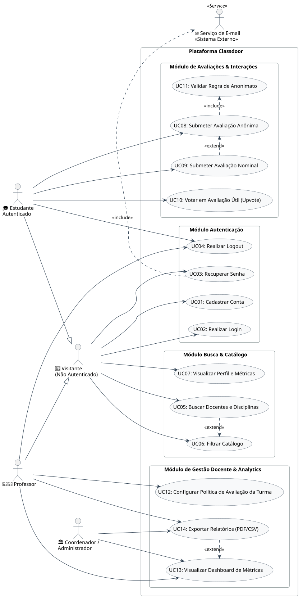
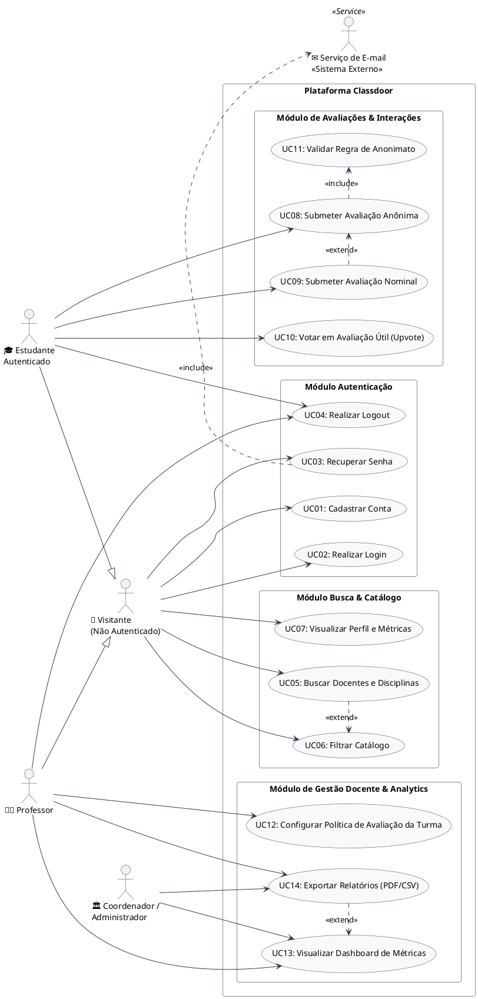

# 🎯 Diagramas e Especificação de Casos de Uso (Use Cases) — Classdoor

**Projeto:** Classdoor  
**Documento:** Diagrama de Casos de Uso UML (PlantUML) e Especificação Textual de Atores e Fluxos  
**Data:** 2026-09-04  
**Responsáveis:** @Ada (Engenheira de Requisitos) & @Atlas (Product Manager)  

---

## 1. Atores do Sistema

1. **Visitante (Usuário Não Autenticado):** Usuário externo que acessa a página inicial, busca cursos/professores e visualiza perfis públicos e médias agregadas.
2. **Estudante Autenticado:** Aluno registrado com e-mail institucional validado que emite avaliações (anônimas ou nominais) e interage com upvotes em reviews da comunidade. *(Especialização de Visitante)*
3. **Professor / Docente:** Usuário acadêmico autenticado com perfil docente que gerencia turmas, configura políticas de avaliação e analisa relatórios/métricas em seu dashboard. *(Especialização de Visitante)*
4. **Coordenador / Administrador:** Gestor acadêmico com acesso ampliado para supervisão de departamentos, acompanhamento de indicadores e relatórios agregados.
5. **Serviço de Autenticação / E-mail (Sistema Externo):** Provedor transacional de mensageria responsável pela entrega de links de ativação de conta e tokens de recuperação de senha.

---

## 2. Diagrama Geral de Casos de Uso (UML / PlantUML)

### 📊 Visualização Gráfica do Diagrama

---

### 💻 Código-Fonte PlantUML

---

## 3. Matriz de Casos de Uso e Rastreabilidade

| ID | Caso de Uso | Módulo | Ator(es) Primário(s) | Relacionamento(s) |
|---|---|---|---|---|
| **UC01** | Cadastrar Conta | Autenticação | Visitante | - |
| **UC02** | Realizar Login | Autenticação | Visitante | - |
| **UC03** | Recuperar Senha | Autenticação | Visitante | `<<include>>` Serviço de E-mail |
| **UC04** | Realizar Logout | Autenticação | Estudante, Professor | - |
| **UC05** | Buscar Docentes e Disciplinas | Busca & Catálogo | Visitante | `<<extend>>` UC06 |
| **UC06** | Filtrar Catálogo | Busca & Catálogo | Visitante | Extensão de UC05 |
| **UC07** | Visualizar Perfil e Métricas | Busca & Catálogo | Visitante | - |
| **UC08** | Submeter Avaliação Anônima | Avaliações & Interações | Estudante Autenticado | `<<include>>` UC11 |
| **UC09** | Submeter Avaliação Nominal | Avaliações & Interações | Estudante Autenticado | `<<extend>>` UC08 |
| **UC10** | Votar em Avaliação Útil (Upvote) | Avaliações & Interações | Estudante Autenticado | - |
| **UC11** | Validar Regra de Anonimato | Avaliações & Interações | Sistema (Automático) | Incluso em UC08 |
| **UC12** | Configurar Política de Avaliação | Gestão Docente & Analytics | Professor | - |
| **UC13** | Visualizar Dashboard de Métricas | Gestão Docente & Analytics | Professor, Coordenador | `<<extend>>` UC14 |
| **UC14** | Exportar Relatórios (PDF/CSV) | Gestão Docente & Analytics | Professor, Coordenador | Extensão de UC13 |

---

## 4. Especificação Detalhada dos Casos de Uso Principais

### 🔹 UC01: Cadastrar Conta
- **Ator Principal:** Visitante
- **Pré-condições:** O usuário deve possuir um e-mail institucional válido (`@universidade.edu` / `@instituicao.br`).
- **Fluxo Principal:**
  1. O visitante acessa a tela de Cadastro.
  2. Informa Nome Completo, E-mail Institucional, Senha e Perfil (`Estudante` ou `Professor`).
  3. O sistema valida o formato dos campos e a unicidade do e-mail.
  4. O sistema cria a conta com senha criptografada (BCrypt) e redireciona para o Login.
- **Fluxo de Exceção (E-mail já existente):**
  - O sistema exibe mensagem de erro *"Este e-mail institucional já está cadastrado"* e sugere a recuperação de senha.

---

### 🔹 UC03: Recuperar Senha
- **Ator Principal:** Visitante
- **Atores Secundários:** Serviço de E-mail (Externo)
- **Pré-condições:** Usuário cadastrado no sistema.
- **Fluxo Principal:**
  1. O visitante clica em *"Esqueci minha senha"*.
  2. Informa o e-mail cadastrado.
  3. O sistema gera um token temporário com validade de 30 minutos e despacha via `Serviço de E-mail` (`<<include>>`).
  4. O usuário clica no link recebido e define uma nova senha compatível com as regras de complexidade.

---

### 🔹 UC08: Submeter Avaliação Anônima (Core do Sistema)
- **Ator Principal:** Estudante Autenticado
- **Pré-condições:** Estudante autenticado no sistema.
- **Fluxo Principal:**
  1. O estudante navega até o perfil do professor ou disciplina desejada.
  2. Clica no botão *"Avaliar"*.
  3. Seleciona a Nota Geral (1 a 5 estrelas), Nível de Dificuldade (1 a 5) e indica se recomendaria (Sim/Não).
  4. Seleciona até 3 tags pedagógicas oficiais e escreve um comentário detalhado (mínimo 20 caracteres).
  5. Mantém selecionada a opção padrão *"100% Anônimo"*.
  6. Submete o formulário.
  7. O sistema executa **UC11: Validar Regra de Anonimato** (`<<include>>`), expurga identificadores do estudante, persiste o review público e atualiza as médias agregadas do docente em tempo real.
- **Pós-condições:** A avaliação passa a ser exibida no feed do professor sem qualquer vínculo de autoria.

---

### 🔹 UC09: Submeter Avaliação Nominal
- **Ator Principal:** Estudante Autenticado
- **Pré-condições:** Estudante autenticado e política da turma configurada como `Permitir Identificado` pelo docente.
- **Fluxo Principal:**
  1. O estudante inicia a submissão de avaliação (UC08).
  2. Desmarca a opção anônima e opta por assinar publicamente o review.
  3. O sistema valida se a turma/docente permite avaliações nominais.
  4. A avaliação é persistida exibindo o nome e curso do estudante junto ao comentário.

---

### 🔹 UC10: Votar em Avaliação Útil (Upvote)
- **Ator Principal:** Estudante Autenticado
- **Pré-condições:** Estudante autenticado e avaliação visível.
- **Fluxo Principal:**
  1. O estudante clica no botão de *Upvote* (👍 / Útil) em uma avaliação.
  2. O sistema registra o voto do usuário e incrementa o contador público de utilidade.
  3. O sistema impede votos duplicados do mesmo usuário na mesma avaliação (idempotência).

---

### 🔹 UC12: Configurar Política de Avaliação da Turma
- **Ator Principal:** Professor
- **Pré-condições:** Professor autenticado e com turmas vinculadas.
- **Fluxo Principal:**
  1. O professor acessa o painel de turmas.
  2. Seleciona a turma desejada.
  3. Alterna a política de privacidade entre `Somente Anônimo` (padrão) e `Permitir Identificado`.
  4. Confirma a alteração.
- **Pós-condições:** O formulário de avaliação daquela turma passa a permitir (ou bloquear) o envio de avaliações nominais.

---

### 🔹 UC13: Visualizar Dashboard de Métricas
- **Ator Principal:** Professor, Coordenador / Administrador
- **Pré-condições:** Usuário autenticado com perfil docente ou gestor.
- **Fluxo Principal:**
  1. O usuário acessa a área de Métricas/Dashboard.
  2. O sistema exibe médias agregadas (didática, clareza, pontualidade, dificuldade), volume temporal de avaliações e distribuição de tags.
  3. O usuário pode acionar a exportação de dados via **UC14: Exportar Relatórios** (`<<extend>>`).
