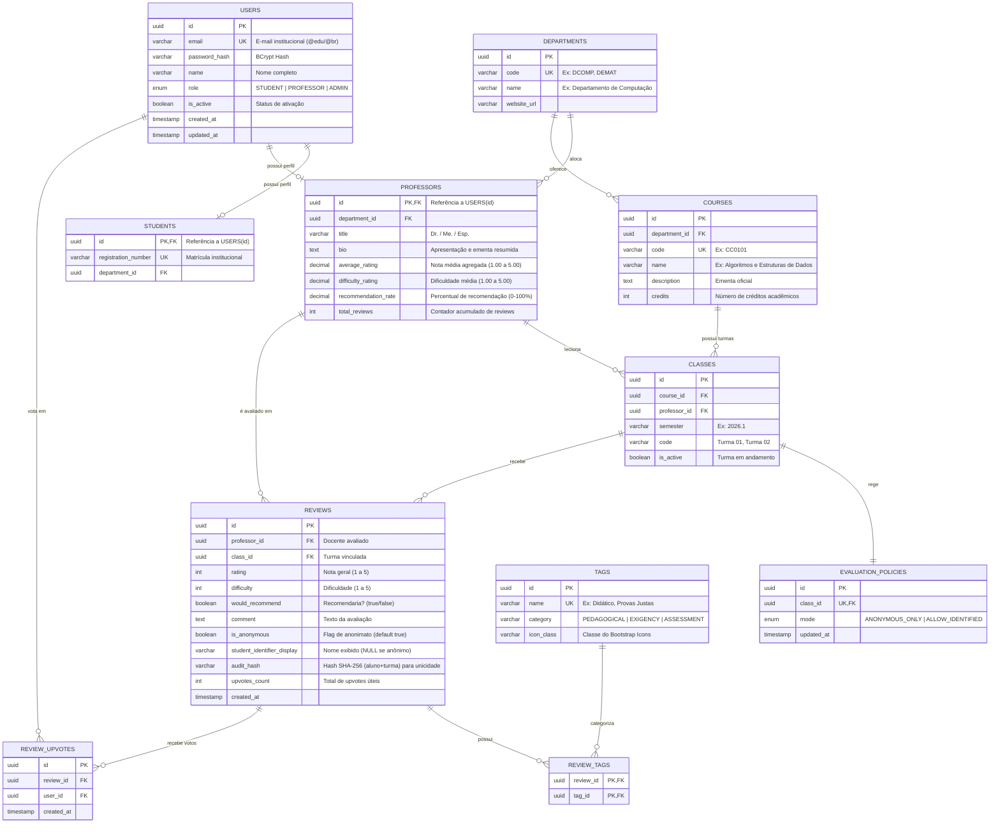

# 🗄️ Modelo Lógico do Banco de Dados — Classdoor

**Projeto:** Classdoor  
**Documento:** Modelo Entidade-Relacionamento (MER Lógico), Dicionário de Dados e Estratégia de Persistência  
**SGBD Alvo:** PostgreSQL 16+  
**Data:** 2026-09-04  
**Responsável:** @Atlas (Product Manager)  

---

## 1. Diagrama Entidade-Relacionamento (ERD / Mermaid)

---

## 2. Dicionário de Dados & Estrutura das Tabelas

### 2.1. Tabela `users`
Armazena a identidade central e credenciais de acesso de todos os usuários da plataforma.

| Coluna | Tipo | Restrições | Descrição |
| :--- | :--- | :--- | :--- |
| `id` | `UUID` | `PRIMARY KEY, DEFAULT gen_random_uuid()` | Identificador único global do usuário. |
| `email` | `VARCHAR(255)` | `NOT NULL, UNIQUE` | E-mail institucional único. |
| `password_hash` | `VARCHAR(255)` | `NOT NULL` | Hash da senha com BCrypt. |
| `name` | `VARCHAR(150)` | `NOT NULL` | Nome completo do usuário. |
| `role` | `VARCHAR(30)` | `NOT NULL, CHECK (role IN ('STUDENT', 'PROFESSOR', 'ADMIN'))` | Papel do usuário no sistema. |
| `is_active` | `BOOLEAN` | `NOT NULL, DEFAULT TRUE` | Indicador de conta ativa. |
| `created_at` | `TIMESTAMP WITH TIME ZONE` | `NOT NULL, DEFAULT NOW()` | Data de criação. |
| `updated_at` | `TIMESTAMP WITH TIME ZONE` | `NOT NULL, DEFAULT NOW()` | Data da última alteração. |

---

### 2.2. Tabela `professors`
Estende o usuário com informações acadêmicas e métricas agregadas pré-computadas para alta performance.

| Coluna | Tipo | Restrições | Descrição |
| :--- | :--- | :--- | :--- |
| `id` | `UUID` | `PRIMARY KEY, REFERENCES users(id) ON DELETE CASCADE` | Chave estrangeira e primária 1:1 com `users`. |
| `department_id` | `UUID` | `NOT NULL, REFERENCES departments(id)` | Departamento ao qual o professor está alocado. |
| `title` | `VARCHAR(50)` | `NULL` | Titulação acadêmica (ex.: Doutor, Mestre). |
| `bio` | `TEXT` | `NULL` | Mini-biografia e áreas de atuação. |
| `average_rating` | `NUMERIC(3, 2)` | `NOT NULL, DEFAULT 0.00` | Média geral das notas (1.00 a 5.00). |
| `difficulty_rating` | `NUMERIC(3, 2)` | `NOT NULL, DEFAULT 0.00` | Média de dificuldade percebida (1.00 a 5.00). |
| `recommendation_rate` | `NUMERIC(5, 2)` | `NOT NULL, DEFAULT 0.00` | Percentual de recomendação (0% a 100%). |
| `total_reviews` | `INTEGER` | `NOT NULL, DEFAULT 0` | Contador total de avaliações recebidas. |

---

### 2.3. Tabela `reviews` (Motor de Avaliações & Anonimato)
Armazena os feedbacks dos estudantes com garantia de desacoplamento de identidade.

| Coluna | Tipo | Restrições | Descrição |
| :--- | :--- | :--- | :--- |
| `id` | `UUID` | `PRIMARY KEY, DEFAULT gen_random_uuid()` | Identificador da avaliação. |
| `professor_id` | `UUID` | `NOT NULL, REFERENCES professors(id) ON DELETE CASCADE` | Professor avaliado. |
| `class_id` | `UUID` | `NOT NULL, REFERENCES classes(id) ON DELETE CASCADE` | Turma avaliada. |
| `rating` | `SMALLINT` | `NOT NULL, CHECK (rating BETWEEN 1 AND 5)` | Nota de 1 a 5 estrelas. |
| `difficulty` | `SMALLINT` | `NOT NULL, CHECK (difficulty BETWEEN 1 AND 5)` | Nível de dificuldade de 1 a 5. |
| `would_recommend` | `BOOLEAN` | `NOT NULL` | Se o aluno recomenda o docente/disciplina. |
| `comment` | `TEXT` | `NOT NULL, CHECK (char_length(comment) >= 20)` | Texto da avaliação detalhada. |
| `is_anonymous` | `BOOLEAN` | `NOT NULL, DEFAULT TRUE` | Flag de avaliação anônima. |
| `student_identifier_display` | `VARCHAR(150)` | `NULL` | Nome público do autor (preenchido SOMENTE se `is_anonymous = FALSE`). |
| `audit_hash` | `VARCHAR(64)` | `NOT NULL, UNIQUE` | Hash SHA-256 (`salt + user_id + class_id`) para evitar avaliações duplicadas sem expor o autor. |
| `upvotes_count` | `INTEGER` | `NOT NULL, DEFAULT 0` | Contagem agregada de votos de utilidade. |
| `created_at` | `TIMESTAMP WITH TIME ZONE` | `NOT NULL, DEFAULT NOW()` | Data de postagem. |

---

## 3. Estratégia de Índices e Performance
Para garantir tempos de resposta $P_{95} < 300\text{ms}$:
1. **`idx_professors_dept_rating`:** `CREATE INDEX idx_professors_dept_rating ON professors(department_id, average_rating DESC);`
2. **`idx_reviews_professor_created`:** `CREATE INDEX idx_reviews_professor_created ON reviews(professor_id, created_at DESC);`
3. **`idx_courses_code_name`:** `CREATE INDEX idx_courses_code_name ON courses(code, name);`
4. **`idx_review_upvotes_unique`:** `CREATE UNIQUE INDEX idx_review_upvotes_user_review ON review_upvotes(user_id, review_id);`
